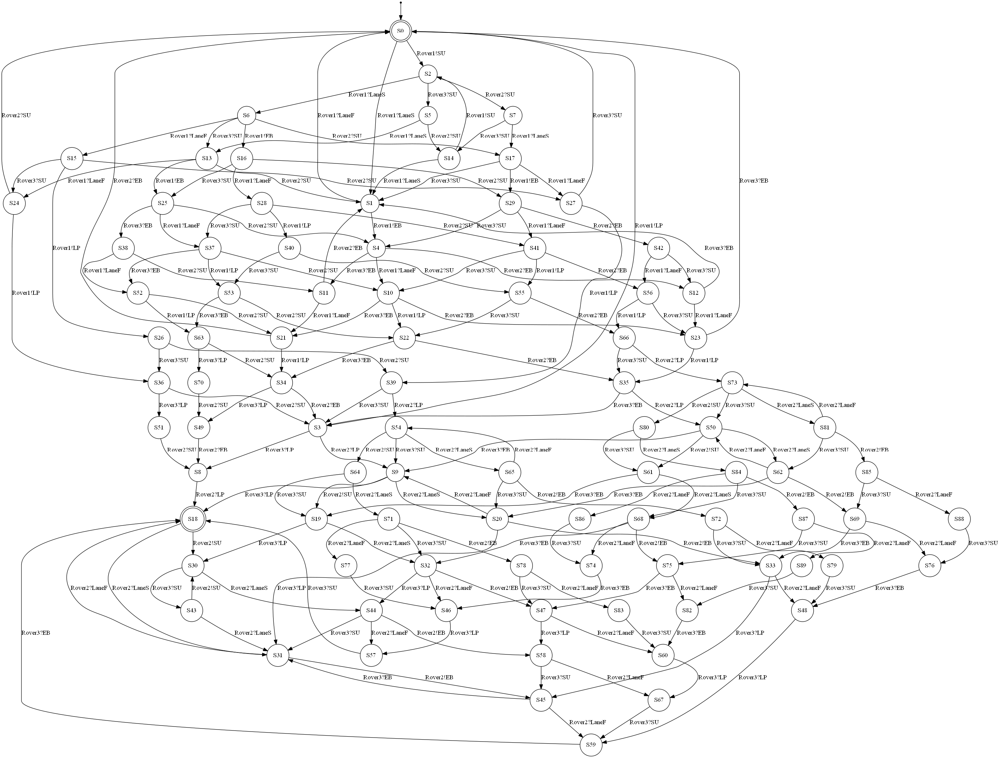
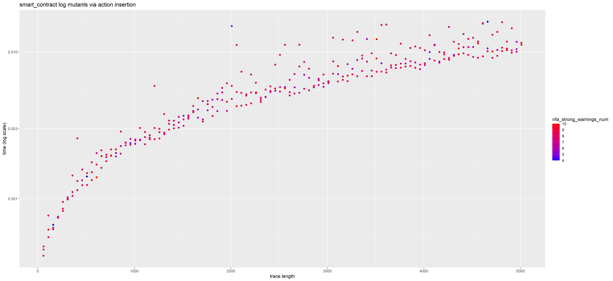

# A small experiment on the use of NFA monitors generated from interaction diagrams using HIBOU

## NFA generation 

We can generate NFA (Non Deterministic Automata) from interaction diagrams (MSC, UML-SD etc) in certain conditions.
More precisely, it works on a subset of an interaction diagram language (see the paper "").

This generation is automated using the "[hibou_label](https://github.com/erwanM974/hibou_label)" tool.
A simple example is given below.

## RV algorithm

We can then use the generated NFA to perform Runtime Verification, either offline or online.
An example is given below (see the paper "" and the library "[autour_process](https://github.com/erwanM974/autour_process)" for more details).

We can use the NFA to continuously monitor a system which behavior is observed via a sequence of atomic actions (a "trace").
Deviations from intended behavior can be observed during monitoring.
In the example below the action "l1?m3" is a strong deviation because it cannot be expressed 
neither from the current state of the NFA at the moment in which it is observed during monitoring
nor from any other state of the NFA (after reset).

Even after the observation of a deviation, the monitoring process can be resumed so that the system is still monitored.

## Experimentations

### Input Interaction Diagrams

We consider 3 usecase systems.

A modelisation of the Alternating Bit Protocol :

A protocol for managing a platoon of autonomous vehicles :

A protocol using smart contracts for human resources management :

### Generated NFAs

Translation to NFA give the following three automata:

For the ABP:

For the platoon of rovers:

For the smart contract example:

### Traces generation

Using the trace generation feature of HIBOU ("[hibou_label](https://github.com/erwanM974/hibou_label)" tool) we generate
three datasets of traces, one for each example usecase.

Each dataset consists of:
- a set of 300 accepted prefixes of lengths between 50 and 5000 
- a set of 600 slices of those prefixes (with actions removed at the beginning and the end)
- a set of 300 mutants obtained by removing 10 actions at random in accepted prefixes
- a set of 300 mutants obtained by inserting 10 actions at random in accepted prefixes

In the following we will refer to those subsets of traces using:
- "ACPT" for the accepted prefixes
- "SLIC" for the slices
- "CHNK" for the mutants obtained by removing actions because what remains are sequences of chunks of the original trace
- "NOIS" for mutants obtained by inserting actions because this corresponds to adding noise to the original trace

Below is represented the folders and files generated when we create the trace dataset 
(because of randomization distinct generations yield distinct datasets).
The original dataset used in plots is given in the "data_archive.zip" archive.

Below is represented an example trace (here for the ABP usecase).

### Correctness of analyses

As a form of experimental validation of our translation and RV algorithm we compare the results of analyzing the traces
using interaction global trace analysis and the NFA RV algorithm.

We can make sure that:
- for the ACPT, interaction trace analysis returns a Pass and NFA trace analysis warns of no deviations at all
- for the SLIC, interaction trace analysis returns a (Weak)Pass and NFA trace analysis warns either 0 or 1 weak deviation (which corresponds to the reset at the start of the slice)
- for the CHNK mutants, (Weak)Fail <=> one or more weak deviation
- for the NOIS mutants, (Weak)Fail <=> one or more weak or strong deviation

For interaction trace analysis we use:
- the algorithm from "[Revisiting Semantics of Interactions for Trace Validity Analysis](https://link.springer.com/chapter/10.1007%2F978-3-030-45234-6_24)" for ACPT traces
- the algorithm from "JOT paper" (see also "[simulation usecases](https://github.com/erwanM974/hibou_simulation_usecases_for_slice_recognition)) for the other traces

We run both methods on all 4500 traces (3 usecases, 1500 traces per usecase).
For the 3 examples we generate a ".csv" file containing the experimental data.

Below are excerpts of the ".csv" file which we have generated for the ABP usecase.
In the table, we have one row per trace and the following columns:
- the name of the trace
- the kind of trace (ACPT, SLIC, CHNK, NOIS)
- the length of the trace
- the time required for the method using interaction global trace analysis (list of tries and median)
- the verdict returned by the interaction global trace analysis
- the time required for the method using NFA trace analysis (list of tries and median)
- the number of weak deviation warnings emitted by the nfa trace analysis
- the number of strong deviation warnings emitted by the nfa trace analysis

For the ACPT traces we observe indeed that we have a WeakPass verdict and no warnings.

For the SLIC traces we observe indeed that we have a WeakPass verdict and 1 weak deviation warning.

For the CHNK traces we observe that we generally have a WeakFail verdict and a number of weak deviation warnings.
It is expected that we do not have strong deviations because all chunks of the trace correspond to correct behaviors.

For the NOIS traces we observe that we generally have a WeakFail verdict and a number of weak and strong deviation warnings.

### Performances

We may also compare the time (median of 3 tries) required to perform the analyses using both methods.

Let us remark however that for the mutants, interaction global trace analysis may return a (Weak)Fail and stop as soon as a first deviation is observed.
By contrast, the NFA RV algorithm continues even after a first deviation occurs and will emit warnings for each deviation.
Because of this, it is not pertinent to compare execution times for mutants.

We exploit the ".csv" file to plot results using the "R_plot.r" r script.

In the following we present results obtained running the experiment on an
 Intel(R) Core(TM) i5-6360U CPU @ 2.00GHz 1.99 GHz
 with 8.00 GB RAM.
 
We have used HIBOU version 0.8.5.

With the R code comprised in this repository, we extract statistical information from the "csv" tables that are generated
and draw scatterplots to represent the results graphically.

In those plots, each point corresponds to a given trace.
Its position corresponds to the time taken to analyse it (on the *y* axis), and its length i.e. total number of actions (on the *x* axis, with some jitter added to better see distinct points).

For the ACPT and SLIC subsets of traces, the color represents the method used, 
*blue* for interaction global trace analysis 
and 
*green* for nfa word analysis.

For the CHNK and NOIS subsets of traces, we only represent the times using the NFA word analysis method and
the color scale respectively represent the number of weak and strong warnings emitted.

#### ABP

#### Rover

#### Smart contract

#### Interpretation of the results

The time in plots is represented in LOG scale.
We observe a gain of 2 orders of magnitude using the NFA method over the interaction-based method for the ACPT and SLIC traces.

The CHNK and NOIS plots hint that the presence or absence of deviations does not impact the rate at which the NFA method operates.

As such we can infer the stable rate of the monitor by dividing time for analysis by the length of the trace.
The mean value of the analysis time on traces of length 5000 is:
- 0.01135253 for the ABP usecase, which yield a rate of around 440000 actions per second
- 0.01241385 for the Rover usecase, which yield a rate of around 400000 actions per second
- 0.01417595 for the Smart contract usecase, which yield a rate of around 350000 actions per second

Let us recall the experiments were run on an
 Intel(R) Core(TM) i5-6360U CPU @ 2.00GHz 1.99 GHz
 with 8.00 GB RAM.
 
 